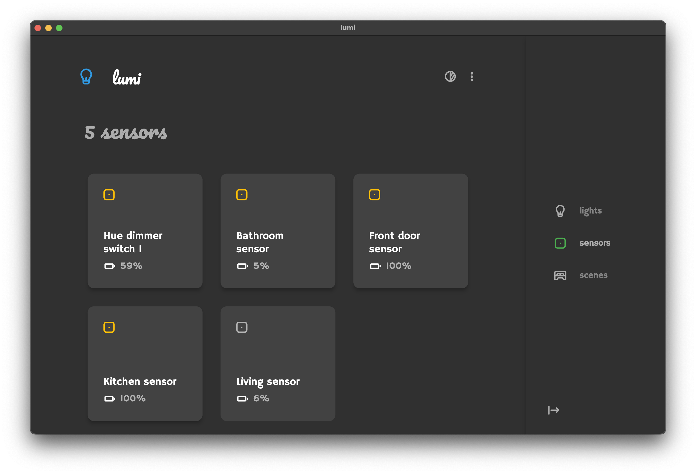

#  lumi

Philips Hue web app to control lights and sensors.

## Features

The features are pretty basic for now.

* Control lights
  * Change hue, brightness, saturation
  * Use random palette colors
* Control sensors
  * Switch ON/OFF
* Control groups (& rooms)
  * Switch ON/OFF

## License

MIT
